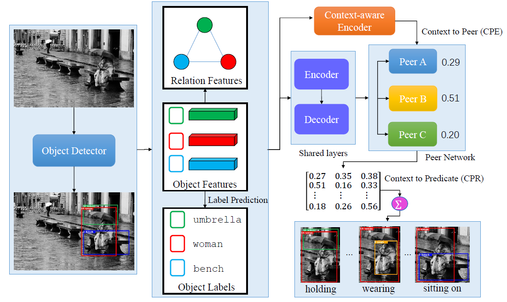

# Context-aware Peer Network for Unbiased Scene Graph Generation


[](https://github.com/KaihuaTang/Scene-Graph-Benchmark.pytorch/blob/master/LICENSE)
[](https://www.python.org/)


Pytorch implementation of paper:

Context-aware Peer Netowrk for Unbiased Scene Graph Generation 


## Contents

1. [Overview](#Overview)
2. [Install the Requirements](INSTALL.md)
3. [Prepare the Dataset](DATASET.md)
4. [Metrics and Results for our Toolkit](METRICS.md)
    - [Explanation of R@K, mR@K, zR@K, ng-R@K, ng-mR@K, ng-zR@K, A@K, S2G](METRICS.md#explanation-of-our-metrics)
    - [Output Format](METRICS.md#output-format-of-our-code)
    - [Reported Results](METRICS.md#reported-results)
5. [Training on Scene Graph Generation](#perform-training-on-scene-graph-generation)
6. [Evaluation on Scene Graph Generation](#Evaluation)
14. [Citations](#Citations)
14. [Acknowledgement](#Acknowledgement)

## Overview


The performance of proposed CAPN is shown in the following  Table.

Tasks | PredCls | PredCls | SGCls | SGCls | SGGen | SGGen 
-- | -- | -- | -- | -- | -- | -- 
Models | R@50/100 | mR@50/100 | R@50/100 | mR@50/100 | R@50/100 | mR@50/100 
Motifs-CAPN | 55.3 / 57.4 | 37.9 / 40.1 | 34.6 /  35.5 | 19.3 / 21.3 | 28.2 / 32.3 | 16.2 / 18.8 
VCTree-CAPN | 58.3 / 60.2      | 37.4 / 40.0 | 38.5 / 39.6 | 24.1 / 25.1 | 27.0 / 31.0    | 16.0 / 18.9 


### The illustration of the Context-aware Peer Network 




## Installation

Check [INSTALL.md](INSTALL.md) for installation instructions.


## Dataset

Check [DATASET.md](DATASET.md) for instructions of dataset preprocessing.


## Metrics and Results **(IMPORTANT)**

Explanation of metrics in our toolkit and reported results are given in [METRICS.md](METRICS.md)


## Pretrained Models

Since we tested many SGG models in our paper [Unbiased Scene Graph Generation from Biased Training](https://arxiv.org/abs/2002.11949), I won't upload all the pretrained SGG models here. However, you can download the [pretrained Faster R-CNN](https://onedrive.live.com/embed?cid=22376FFAD72C4B64&resid=22376FFAD72C4B64%21779870&authkey=AH5CPVb9g5E67iQ) we used in the paper, which is the most time consuming step in the whole training process (it took 4 2080ti GPUs). As to the SGG model, you can follow the rest instructions to train your own, which only takes 2 GPUs to train each SGG model. The results should be very close to the reported results given in [METRICS.md](METRICS.md)

After you download the [Faster R-CNN model](https://onedrive.live.com/embed?cid=22376FFAD72C4B64&resid=22376FFAD72C4B64%21779870&authkey=AH5CPVb9g5E67iQ), please extract all the files to the directory `/home/username/checkpoints/pretrained_faster_rcnn`. To train your own Faster R-CNN model, please follow the next section.

The above pretrained Faster R-CNN model achives 38.52/26.35/28.14 mAp on VG train/val/test set respectively.


## Perform training on Scene Graph Generation

There are **three standard protocols**: (1) Predicate Classification (PredCls): taking ground truth bounding boxes and labels as inputs, (2) Scene Graph Classification (SGCls) : using ground truth bounding boxes without labels, (3) Scene Graph Detection (SGDet): detecting SGs from scratch. We use two switches ```MODEL.ROI_RELATION_HEAD.USE_GT_BOX``` and ```MODEL.ROI_RELATION_HEAD.USE_GT_OBJECT_LABEL``` to select the protocols. 

For **Predicate Classification (PredCls)**, we need to set:
``` bash
sh scripts/motifs/train_capn_predcls.sh
```
For **Scene Graph Classification (SGCls)**:

``` bash
sh scripts/motifs/train_capn_sgcls.sh
```
For **Scene Graph Detection (SGDet)**:
``` bash
sh scripts/motifs/train_capn_sgdet.sh
```

### Different Baseline Models
There are three baseline models used for training, you can either pick one for training.

For [Motifs](https://arxiv.org/abs/1711.06640) Model:
```bash
sh scripts/motifs/train_capn_predcls.sh
```
For [VCTree](https://arxiv.org/abs/1812.01880) Model:
```bash
sh scripts/vctree/train_capn_predcls.sh
```
For Transformer Model:

```
sh scripts/transformer/train_capn_predcls.sh
```


## Evaluation

Test Example 1 : (PreCls, Motif-CAPN Model)
```bash
sh scripts/motifs/test_capn_predcls.sh
```

Test Example 2 : (PreCls, VCTree-CAPN Model)
```bash
sh scripts/motifs/test_capn_predcls.sh
```


## Visualize Detected SGs of Custom Images
The visualization of SGG in three tasks can be found in the following links:

PredCls and SGCls:

```
https://github.com/FreeformRobotics/CAPN/blob/main/visualization/1.visualize_PredCls_and_SGCls.ipynb
```

SGDet:

```
https://github.com/FreeformRobotics/CAPN/blob/main/visualization/3.visualize_custom_SGDet.ipynb
```

## Citations

If you find this project helps your research, please kindly consider citing our project or papers in your publications.

```
@article{zhou2022context,
  title={Context-aware peer network for unbiased scene graph generation},
  author={Zhou, Liguang and Zhou, Yuhongze and Hu, Junjie and Lam, Tin Lun and Xu, Yangsheng},
  journal={arXiv preprint arXiv:2208.07109},
  year={2022}
}
```


## Acknowledgement

[1] https://github.com/KaihuaTang/Scene-Graph-Benchmark.pytorch/
