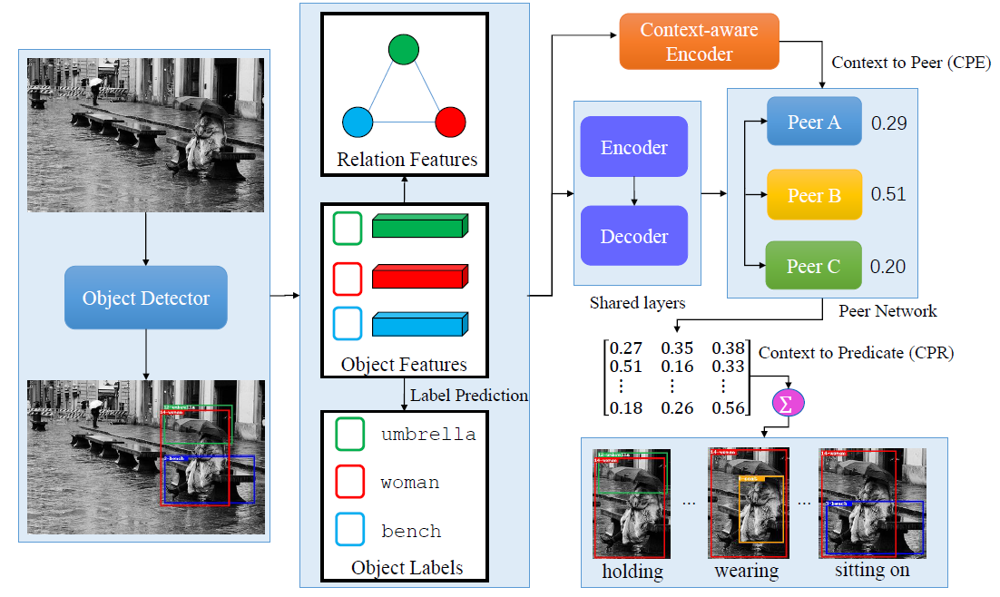

# CAPN: Context-Aware Peer Networks for Unbiased Scene Graph Generation

Official PyTorch implementation of **Debiasing Scene Graph Generation with Context-Aware Peer Networks**, accepted by *Pattern Recognition* in 2026.

CAPN augments Motifs, VCTree, and Transformer scene-graph backbones with three peer predictors and context-conditioned peer-level and predicate-level modulation. The method targets a better balance between conventional Recall (R@K) and mean Recall (mR@K) on long-tailed predicate distributions.



## Installation

Follow [INSTALL.md](INSTALL.md) to build the environment. The original experiments used Python 3.7, PyTorch 1.6, CUDA, and NVIDIA Apex mixed precision.

## Datasets

Follow [DATASET.md](DATASET.md) to prepare Visual Genome and Open Images V6. By default, the scripts expect:

- GloVe embeddings under `./glove`;
- the pretrained Faster R-CNN checkpoint at `./checkpoints/pretrained_faster_rcnn/model_final.pth`;
- dataset paths configured through `maskrcnn_benchmark/config/paths_catalog.py`.

Datasets and model checkpoints are not stored in Git.

## Quick Start

The recommended scripts use a common runner and support Motifs, VCTree, and Transformer under PredCls, SGCls, and SGDet.

Train Motifs-CAPN on PredCls with two GPUs:

```bash
GPUS=0,1 SEED=42 bash scripts/motifs/train_capn_predcls.sh
```

Evaluate a checkpoint directory:

```bash
GPUS=0,1 \
OUTPUT_DIR=./checkpoints/motifs-capn-predcls-seed42 \
bash scripts/motifs/test_capn_predcls.sh
```

The training output contains a `last_checkpoint` file that is loaded automatically. To evaluate a standalone checkpoint, append `MODEL.WEIGHT /path/to/model.pth`.

Equivalent commands are available for all supported settings:

```text
scripts/<motifs|vctree|transformer>/<train|test>_capn_<predcls|sgcls|sgdet>.sh
```

For example:

```bash
GPUS=0,1 SEED=42 bash scripts/vctree/train_capn_predcls.sh
GPUS=0,1 SEED=42 bash scripts/transformer/train_capn_predcls.sh
```

### Runtime Options

| Variable | Default | Description |
| --- | --- | --- |
| `GPUS` | `0,1` | Comma-separated visible GPU IDs |
| `SEED` | `42` | Training seed |
| `GLOVE_DIR` | `./glove` | GloVe directory |
| `DETECTOR_CKPT` | `./checkpoints/pretrained_faster_rcnn/model_final.pth` | Detector checkpoint |
| `OUTPUT_DIR` | task-dependent | Training output or evaluation checkpoint directory |
| `LOSS_OPTION` | `CAME_LOSS` | Relation loss |
| `NUM_EXPERTS` | `3` | Number of peers |
| `PER_CLASS_CONTEXT_AWARE` | backbone-dependent | Enable predicate-level context modulation |
| `PER_CLASS_ALPHA` | `1.0` for Motifs, `0.5` otherwise | Predicate-level modulation coefficient |
| `BASE_LR` | `0.01`, or `0.001` for Transformer | Base learning rate |
| `TRAIN_BATCH` | `12` | Global training batch size |
| `MAX_ITER` | `50000` | Maximum training iterations |
| `SYNC_GATHER` | `False` | Index-safe distributed evaluation gathering |
| `DRY_RUN` | `0` | Print the resolved command without running it |

Additional configuration overrides can be appended to any wrapper:

```bash
GPUS=2,3 SEED=379 MAX_ITER=24000 \
bash scripts/motifs/train_capn_predcls.sh SOLVER.VAL_PERIOD 1000
```

## Results

Results reported in the accepted manuscript on Visual Genome are:

| Backbone | PredCls R@50/100 | PredCls mR@50/100 | SGCls R@50/100 | SGCls mR@50/100 | SGDet R@50/100 | SGDet mR@50/100 |
| --- | ---: | ---: | ---: | ---: | ---: | ---: |
| Motifs-CAPN | 55.3 / 57.4 | 37.9 / 40.1 | 34.6 / 35.5 | 19.3 / 21.3 | 28.2 / 32.3 | 16.2 / 18.8 |
| VCTree-CAPN | 58.3 / 60.2 | 37.4 / 40.0 | 38.5 / 39.6 | 24.1 / 25.1 | 27.0 / 31.0 | 16.0 / 18.9 |
| Transformer-CAPN | 55.1 / 57.2 | 37.4 / 39.9 | 33.2 / 34.1 | 23.1 / 24.5 | 27.4 / 31.6 | 16.9 / 19.5 |

Small differences can result from the CUDA/PyTorch version, distributed sampling, and random seed. Keep all settings fixed and vary only `SEED` for statistical studies.

See [METRICS.md](METRICS.md) for metric definitions and output formats.

## Open Images V6

Open Images V6 experiments use the SGDet protocol. The original scripts are available as `scripts/*/*_capn_sgdet_oviv6.sh`; set their dataset and detector paths before use.

## Visualization

- PredCls and SGCls: [visualization/1.visualize_PredCls_and_SGCls.ipynb](visualization/1.visualize_PredCls_and_SGCls.ipynb)
- Custom SGDet: [visualization/3.visualize_custom_SGDet.ipynb](visualization/3.visualize_custom_SGDet.ipynb)

## Checkpoints

Large detector and SGG checkpoints are excluded from the source repository. Released models should document their backbone, task, seed, configuration, and reported metrics.

## Citation

```bibtex
@article{zhou2026capn,
  title   = {Debiasing Scene Graph Generation with Context-Aware Peer Networks},
  author  = {Zhou, Liguang and Zhou, Yuhongze and Hu, Junjie and Lam, Tin Lun and Xu, Yangsheng},
  journal = {Pattern Recognition},
  year    = {2026},
  note    = {Accepted}
}
```

## Acknowledgement

This project builds on [Scene-Graph-Benchmark.pytorch](https://github.com/KaihuaTang/Scene-Graph-Benchmark.pytorch) and the original implementations of Motifs and VCTree.
